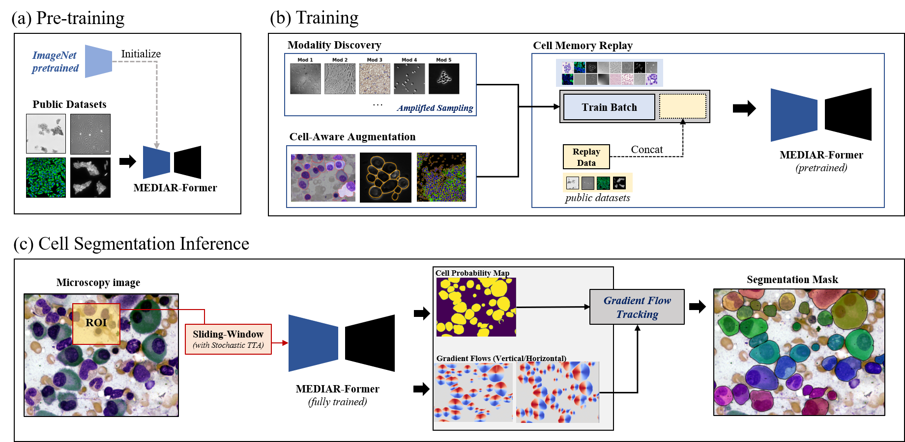
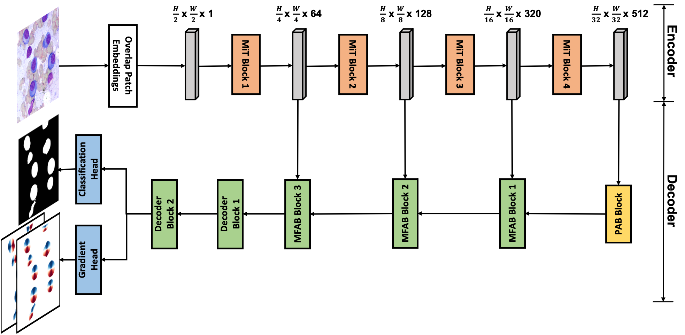

# **MEDIAR: Harmony of Data-Centric and Model-Centric for Multi-Modality Microscopy**

Submission for [Weakly Supervised Cell Segmentation in Multi-modality High-Resolution Microscopy Images](https://neurips22-cellseg.grand-challenge.org/)

# 1. Overview


The above figure illurstrate our framework, <b>*MEDIAR*</b>. MEDIAR harmonizes data-centric and model-centric approaches as the learning and inference strategies, achieving a **0.9067** F1-score at the validation phase. The pipeline is composed of training, (a) Pre-training phase and (b) Training phase and inference, (c) Cell Segmentation Inference. We adopt [CellPose](https://github.com/MouseLand/cellpose) for our preprocessing and postprocessing.

# 2. Methods

## **Data-Centric**
1. **Cell Aware Augmentation** : We apply two novel cell-aware augmentations. Since the intensity of the cells in the image could differ, *cell-wisely intensity is randomized* (Cell Intensity Diversification). we *excluded the boundary pixels* in the label. The boundary exclusion is adopted only in the pre-training phase.

2. **Two-phase Pretraining and Fine-tuning** : To extract knowledge from large public datasets, we first pretrained our model on public sets, then fine-tune.
    - Pretraining : We use 7,241+ labeled images from four public datasets for pretraining: OmniPose, CellPose, LiveCell and DataScienceBowl-2018. MEDIAR takes two different phases for the pretraining. the MEDIAR-Former model with encoder parameters initialized from ImageNet-1k pretraining.

    - Fine-tuning : We use two different model for ensemble. First model is fine-tuned 200 epochs using target datasets. Second model is fine-tuned 25 epochs using both target and public datsets.

3. **Modality Discovery & Amplified Sampling** : The target dataset is imbalanced dataset that the number of modalities is more than 4. Therefore, we first group the encoder embeddings from the phase-1 pretrained model via the k-means clustering algorithm, then over-sample the minor data points to 40.

4. **Cell Memory Replay** : We find that pre-trained model performs surprisingly well in vast modalities with an F1 score above 0.85, however, fine-tuned model performs well in such cases but degrades on some of the modalities in which the
pre-trained model performs well. To address it, we use memory replay in continual learning by oncatenate
the data from the public dataset with a small portion to the batch and train with boundary-excluded
labels.

## **Model-Centric**
1. **MEDIAR-Former Architecture** : The below illurstration is architecture of MEDIAR-Former. MEDIAR-Former follows the design paradigm of U-Net. For the encoder and decoder, we adopt SegFormer and MA-Net. MEDIAR-Former uses two separate heads. 



2. **Gradient Flow Tracking** : We utilize gradient flow tracking proposed by [CellPose](https://github.com/MouseLand/cellpose). Using the ground-truth cell masks drawn by a human annotator, we produced topological maps through a process of simulated diffusion. Then, MEDIAR-Former was trained to predict the horizontal and vertical gradients of the topological maps, as well as a binary map indicating whether or not a given pixel is cell or not. MEDIAR-Former predicted the vector fields formed by the horizontal and vertical gradients. All pixels belonging to a given cell can be routed to its center by following the vector fields through a process known as gradient tracking. Thus, by grouping pixels that converge on the same point, we recover the precise shapes of individual cells. The cell shapes were refined further by removing pixels that the neural network predicted to be outside of cells.

# 3. Experiments

### **Dataset**
- Target Dataset
  - We are provided the target dataset from [Weakly Supervised Cell Segmentation in Multi-modality High-Resolution Microscopy Images](https://neurips22-cellseg.grand-challenge.org/). It consists of 1000 labeled images, 1712 unlabeled images and 13 unlabeled whole slide image from various microscopy types, tissue types, and staining types. Validation set is given with 101 images.

- Public Dataset
  - OmniPose : 4833 images containing manually annotated about 700900 cells from mixtures of 14 bacterial species.
  - CellPose : 608 images and labels containing about 70000 cells collected via internet searches for keywords such as cytoplasm, cellular microscopy, fluorescent cells and so on.
  - LiveCell : 5239 images containisng 1686352 individual cells that annotated by trained crowd sourcers from 8 distinct cell types. The dataset is splitted to 3188 training set, 539 validation set and 1512 test set.
  - DataScienceBowl 2018 : 841 images containing 37333 cells that annotated by a single expert and examined by the rest from 22 cell types, 15 image resolutions and five groups of visually similar images

### **Testing steps**
- **Ensemble Prediction with TTA** :  MEDIAR uses sliding-window inference with the overlap size between the adjacent patches as 0.6 and gaussian importance map. To predict the different views on the image, MEDIAR uses Test-Time Augmentation (TTA) for the model prediction and ensemble two models described in **Two-phase Pretraining and Fine-tuning**.

- **Inference time** : MEDIAR conducts most images in less than 1sec and it depends on the image size and the number of cells, even with ensemble prediction with TTA. Detailed evaluation-time results are in the paper.  

### **Augmentations**
| Strategy  |      Class      |  Probability |
|----------|:-------------|------|
| `Clip` |  Pre-processing | . |
| `Normalization` |  Pre-processing | . |
| `Scale Intensity` |  Pre-processing | . |
| `Zoom` |  Spatial Augmentation | 0.5 |
| `Spatial Crop` |  Spatial Augmentation | . |
| `Axis Flip` |  Spatial Augmentation | 0.5 |
| `Rotation` |  Spatial Augmentation | 0.5 |
| `Cell-Aware Intensity` |  Intensity Augmentation | 0.25 |
| `Gaussian Noise` |  Intensity Augmentation | 0.25 |
| `Contrast Adjustment` |  Intensity Augmentation | 0.25 |
| `Gaussian Smoothing` |  Intensity Augmentation | 0.25 |
| `Histogram Shift` |  Intensity Augmentation | 0.25 |
| `Gaussian Sharpening` |  Intensity Augmentation | 0.25 |
| `Boundary Exclusion` | Others | . |


| Learning Setups                                             | Pretraining                                    | Fine-tuning                                    |
|----------------------------------------------------------------------|---------------------------------------------------------|---------------------------------------------------------|
| Initialization (Encoder)                                             | Imagenet-1k pretrained                                  | pretrained                                              |
| Initialization (Decoder, Head)                                            |            He normal initialization                                        | pretrained |
| Batch size                                                           | 9                                                       | 9                                                       |
| Total epochs                                                         | 80                                                      | 200                                                      |
| Optimizer                                                            | AdamW                                     | AdamW                                     |
| Initial learning rate (lr)                                           | 5e-5                                                    | 2e-5                                                    |
| Lr decay schedule                                                    | Cosine scheduler (100 interval) | Cosine scheduler (100 interval) |
| Training time                                                        | 72 hours                                                | 48 hours                                                |
| Loss function                                                        | MSE, Binary cross entropy                               | MSE, Binary cross entropy                               |
| Number of model parameters | 121.31 M                                                | 121.31 M                                                |
| Number of flops| 204.26 G                                                | 204.26 G                                                |
| $\text{C{O}}_{2}eq$ | 15.105g                                                 | 9.876g                                                  |


# 4. Results

- Quantitative analysis of cross validation results and/or testing set results
  - average and standard deviation of evaluation metrics
  - statistical analysis (e.g., statistical methods, significant levels...)

- Qualitative analysis
  - box/violin plot, ROC curves
  - visualized examples of both successful and **failed** cases

# 5. Reproducing

### **Our Environment**
| Computing Infrastructure| |
|-------------------------|----------------------------------------------------------------------|
| System                  | Ubuntu 18.04.5 LTS                                                   |
| CPU                     | AMD EPYC 7543 32-Core Processor CPU@2.26GHz                          |
| RAM                     | 500GB; 3.125MT/s                                                     |
| GPU (number and type)   | NVIDIA A5000 (24GB) 2ea                                              |
| CUDA version            | 11.7                                                                 |
| Programming language    | Python 3.9                                                           |
| Deep learning framework | Pytorch (v1.12, with torchvision v0.13.1)             |
| Code dependencies       | MONAI (v0.9.0), Segmentation Models (v0.3.0) |
| Specific dependencies   | None                                                                 |

To install requirements:

```setup
pip install -r requirements.txt
```

## Dataset

- We are provided the target datasets from the challenge organizers and the public datsets from -, -, -, -

## Data Mapping

Before execute the codes, run the data mapping code:

```python
python generate_mapping.py --root=<path_to_data>
```

## Training

To train the model(s) in the paper, run this command:

```train
python main.py --config_path=<path_to_config>
```
Configuration files are in `config`

## Inference

To infer the testing cases, run this command:

```python
python predict.py --config_path=<path_to_config>
```

## Trained Models

You can download trained models here:

- [My awesome model](https://drive.google.com/mymodel.pth) trained on the above dataset with the above code. 

