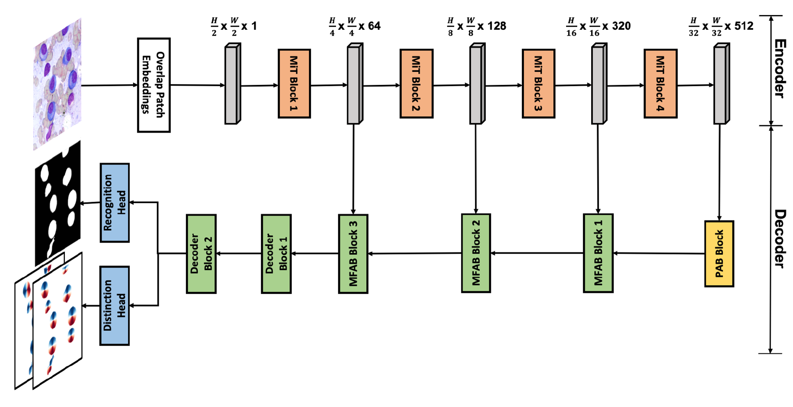

# **MEDIAR: Harmony of Data-Centric and Model-Centric for Multi-Modality Microscopy**


This repository provides an official implementation of [MEDIAR: MEDIAR: Harmony of Data-Centric and Model-Centric for Multi-Modality Microscopy](https://arxiv.org/abs/2212.03465), which achieved the ***"1st winner"*** in the [NeurIPS-2022 Cell Segmentation Challenge](https://neurips22-cellseg.grand-challenge.org/).

To access and try mediar directly, please see links below.
- <a href="https://colab.research.google.com/drive/1iFnGu6A_p-5s_eATjNtfjb9-MR5L3pLB?usp=sharing"></a>
- [Huggingface Space](https://huggingface.co/spaces/ghlee94/MEDIAR?logs=build)
- [Napari Plugin](https://github.com/joonkeekim/mediar-napari)
- [Docker Image](https://hub.docker.com/repository/docker/joonkeekim/mediar/general)

# 1. MEDIAR Overview


MEIDAR is a framework for efficient cell instance segmentation of multi-modality microscopy images. The above figure illustrates an overview of our approach. MEDIAR harmonizes data-centric and model-centric approaches as the learning and inference strategies, achieving a **0.9067** Mean F1-score on the validation datasets. We provide a brief description of methods that combined in the MEDIAR. Please refer to our paper for more information.
# 2. Methods

## **Data-Centric**
- **Cell Aware Augmentation** : We apply two novel cell-aware augmentations. *cell-wisely intensity is randomization* (Cell Intensity Diversification) and *cell-wise boundary pixels exclusion* in the label. The boundary exclusion is adopted only in the pre-training phase.

- **Two-phase Pretraining and Fine-tuning** : To extract knowledge from large public datasets, we first pretrained our model on public sets, then fine-tune.
    - Pretraining : We use 7,2412 labeled images from four public datasets for pretraining: OmniPose, CellPose, LiveCell and DataScienceBowl-2018. MEDIAR takes two different phases for the pretraining. the MEDIAR-Former model with encoder parameters initialized from ImageNet-1k pretraining.

    - Fine-tuning : We use two different model for ensemble. First model is fine-tuned 200 epochs using target datasets. Second model is fine-tuned 25 epochs using both target and public datsets.

- **Modality Discovery & Amplified Sampling** : To balance towards the latent modalities in the datasets, we conduct K-means clustering and discover 40 modalities. In the training phase, we over-sample the minor cluster samples.

- **Cell Memory Replay** : We concatenate the data from the public dataset with a small portion to the batch and train with boundary-excluded labels.

## **Model-Centric**
- **MEDIAR-Former Architecture** : MEDIAR-Former follows the design paradigm of U-Net, but use SegFormer and MA-Net for the encoder and decoder. The two heads of MEDIAR-Former predicts cell probability and gradieng flow. 



- **Gradient Flow Tracking** : We utilize gradient flow tracking proposed by [CellPose](https://github.com/MouseLand/cellpose).

- **Ensemble with Stochastic TTA**: During the inference, the MEIDAR conduct prediction as sliding-window manner with importance map generated by the gaussian filter. We use two fine-tuned models from phase1 and phase2 pretraining, and ensemble their outputs by summation. For each outputs, test-time augmentation is used.
# 3. Experiments

### **Dataset**
- Official Dataset
  - We are provided the target dataset from [Weakly Supervised Cell Segmentation in Multi-modality High-Resolution Microscopy Images](https://neurips22-cellseg.grand-challenge.org/). It consists of 1,000 labeled images, 1,712 unlabeled images and 13 unlabeled whole slide image from various microscopy types, tissue types, and staining types. Validation set is given with 101 images including 1 whole slide image.

- Public Dataset
  - [OmniPose](http://www.cellpose.org/dataset_omnipose) : contains mixtures of 14 bacterial species. We only use 611 bacterial cell microscopy images and discard 118 worm images.
  - [CellPose](https://www.cellpose.org/dataset) : includes Cytoplasm, cellular microscopy, fluorescent cells images. We used 551 images by discarding 58 non-microscopy images. We convert all images as gray-scale.
  - [LiveCell](https://github.com/sartorius-research/LIVECell) : is a large-scale dataset with 5,239 images containing 1,686,352 individual cells annotated by trained crowdsources from 8 distinct cell types.
  - [DataScienceBowl 2018](https://www.kaggle.com/competitions/sartorius-cell-instance-segmentation/overview) : 841 images contain 37,333 cells from 22 cell types, 15 image resolutions, and five visually similar groups.

### **Testing steps**
- **Ensemble Prediction with TTA** : MEDIAR uses sliding-window inference with the overlap size between the adjacent patches as 0.6 and gaussian importance map. To predict the different views on the image, MEDIAR uses Test-Time Augmentation (TTA) for the model prediction and ensemble two models described in **Two-phase Pretraining and Fine-tuning**.

- **Inference time** : MEDIAR conducts most images in less than 1sec and it depends on the image size and the number of cells, even with ensemble prediction with TTA. Detailed evaluation-time results are in the paper.  

### **Preprocessing & Augmentations**
| Strategy  |      Type      |  Probability |
|----------|:-------------|------|
| `Clip` |  Pre-processing | . |
| `Normalization` |  Pre-processing | . |
| `Scale Intensity` |  Pre-processing | . |
| `Zoom` |  Spatial Augmentation | 0.5 |
| `Spatial Crop` |  Spatial Augmentation | 1.0 |
| `Axis Flip` |  Spatial Augmentation | 0.5 |
| `Rotation` |  Spatial Augmentation | 0.5 |
| `Cell-Aware Intensity` |  Intensity Augmentation | 0.25 |
| `Gaussian Noise` |  Intensity Augmentation | 0.25 |
| `Contrast Adjustment` |  Intensity Augmentation | 0.25 |
| `Gaussian Smoothing` |  Intensity Augmentation | 0.25 |
| `Histogram Shift` |  Intensity Augmentation | 0.25 |
| `Gaussian Sharpening` |  Intensity Augmentation | 0.25 |
| `Boundary Exclusion` | Others | . |


| Learning Setups                                             | Pretraining                                    | Fine-tuning                                    |
|----------------------------------------------------------------------|---------------------------------------------------------|---------------------------------------------------------|
| Initialization (Encoder)                                             | Imagenet-1k pretrained                                  | from Pretraining                                              |
| Initialization (Decoder, Head)                                       |            He normal initialization                     | from Pretraining|
| Batch size                                                           | 9                                                       | 9                                                       |
| Total epochs                                                         | 80 (60)                                                     | 200 (25)                                                     |
| Optimizer                                                            | AdamW                                     | AdamW                                     |
| Initial learning rate (lr)                                           | 5e-5                                                    | 2e-5                                                    |
| Lr decay schedule                                                    | Cosine scheduler (100 interval) | Cosine scheduler (100 interval) |
| Loss function                                                        | MSE, BCE                              | MSE, BCE                               |

# 4. Results
### **Validation Dataset**
- Quantitative Evaluation
    - Our MEDIAR achieved **0.9067** validation mean F1-score.
- Qualitative Evaluation


- Failure Cases


### **Test Dataset**


# 5. Reproducing

### **Our Environment**
| Computing Infrastructure| |
|-------------------------|----------------------------------------------------------------------|
| System                  | Ubuntu 18.04.5 LTS                                                   |
| CPU                     | AMD EPYC 7543 32-Core Processor CPU@2.26GHz                          |
| RAM                     | 500GB; 3.125MT/s                                                     |
| GPU (number and type)   | NVIDIA A5000 (24GB) 2ea                                              |
| CUDA version            | 11.7                                                                 |
| Programming language    | Python 3.9                                                           |
| Deep learning framework | Pytorch (v1.12, with torchvision v0.13.1)             |
| Code dependencies       | MONAI (v0.9.0), Segmentation Models (v0.3.0) |
| Specific dependencies   | None                                                                 |

To install requirements:

```
pip install -r requirements.txt
wandb off
```

## Dataset
- The datasets directories under the root should the following structure:

```
  Root
  ├── Datasets
  │   ├── images (images can have various extensions: .tif, .tiff, .png, .bmp ...)
  │   │    ├── cell_00001.png
  │   │    ├── cell_00002.tif
  │   │    ├── cell_00003.xxx
  │   │    ├── ...  
  │   └── labels (labels must have .tiff extension.)
  │   │    ├── cell_00001_label.tiff 
  │   │    ├── cell_00002.label.tiff
  │   │    ├── cell_00003.label.tiff
  │   │    ├── ...
  └── ...
```

Before execute the codes, run the follwing code to generate path mappting json file:

```python
python ./generate_mapping.py --root=<path_to_data>
```

## Training

To train the model(s) in the paper, run the following command:

```python
python ./main.py --config_path=<path_to_config>
```
Configuration files are in `./config/*`. We provide the pretraining, fine-tuning, and prediction configs. You can refer to the configuration options in the `./config/mediar_example.json`. We also implemented the official challenge baseline code in our framework. You can run the baseline code by running the `./config/baseline.json`.

## Inference

To conduct prediction on the testing cases, run the following command:

```python
python predict.py --config_path=<path_to_config>
```

## Evaluation
If you have the labels run the following command for evaluation:

```python
python ./evaluate.py --pred_path=<path_to_prediciton_results> --gt_path=<path_to_ground_truth_labels>
```

The configuration files for `predict.py` is slightly different. Please refer to the config files in `./config/step3_prediction/*`.
## Trained Models

You can download MEDIAR pretrained and finetuned models here:

- [Google Drive Link](https://drive.google.com/drive/folders/1RgMxHIT7WsKNjir3wXSl7BrzlpS05S18?usp=share_link). 

## Citation of this Work
```
@article{lee2022mediar,
  title={Mediar: Harmony of data-centric and model-centric for multi-modality microscopy},
  author={Lee, Gihun and Kim, SangMook and Kim, Joonkee and Yun, Se-Young},
  journal={arXiv preprint arXiv:2212.03465},
  year={2022}
}
```

